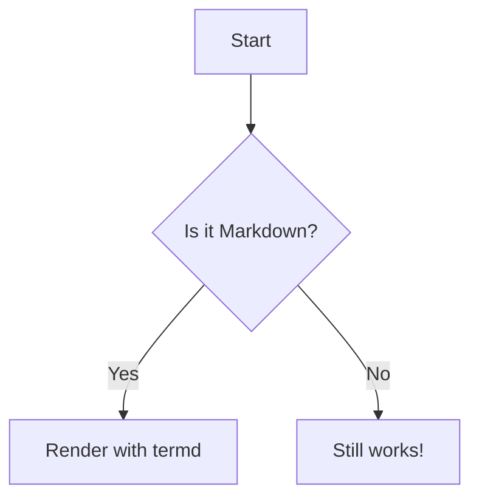

# Formatting Example

This file demonstrates `termd` rendering capabilities.

## 1. Diagrams (Mermaid)

## 2. Tables

| Feature | Support | Note |
| :--- | :---: | :--- |
| GFM | Yes | Full support |
| Tables | Yes | Custom styled |
| Mermaid | Yes | Flowcharts native |

---
See also: [example-2.md](example-2.md), [example-3.md](example-3.md)

## 3. Standard GFM

- **Bold** and *Italic*
- `Inline Code`
- [Links](https://github.com)

> Blockquotes are also supported.
