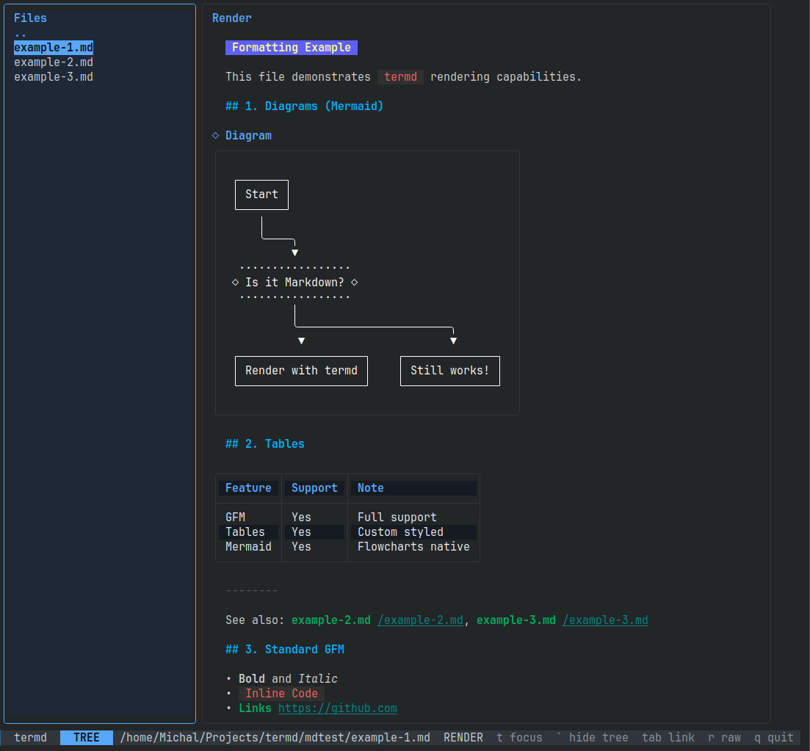

# termd



A minimalistic terminal-based Markdown viewer and editor with support for Mermaid diagrams and GitHub-flavored tables.

... (features) ...

## License
MIT

## Features
- **Browse**: Integrated file tree for navigating directories.
- **Render**: Rich rendering using Glamour, with special handling for Mermaid diagrams and tables.
- **Edit**: Raw editor mode for quick changes to Markdown files.

## Installation

### Shell Script (Recommended)
```bash
curl -fsSL https://raw.githubusercontent.com/mkozakk/termd/main/install.sh | sh
```

### Via GitHub Releases
Download the latest binary from the [Releases](https://github.com/mkozakk/termd/releases) page and place it in your PATH.

### Via Go
```bash
go install github.com/mkozakk/termd@latest
```

## Usage
```bash
termd [path]
```
If no path is provided, it opens in the current directory.

## Keybindings

### Global
- `t`: Toggle focus between tree and content
- `` ` ``: Show/hide file tree
- `q`: Quit
- `ctrl+c`: Quit immediately

### File Tree
- `j` / `↓`: Move down
- `k` / `↑`: Move up
- `Enter`: Open file / enter directory

### Content View
- `j` / `k`: Scroll down / up
- `r`: Switch to raw editor
- `Tab`: Select next link
- `Enter`: Follow link

### Editor (Normal Mode)
- `e`: Enter insert mode
- `r`: Switch back to render view
- `ctrl+s`: Save file
- `esc`: Back to normal mode (from insert)

## License
MIT
